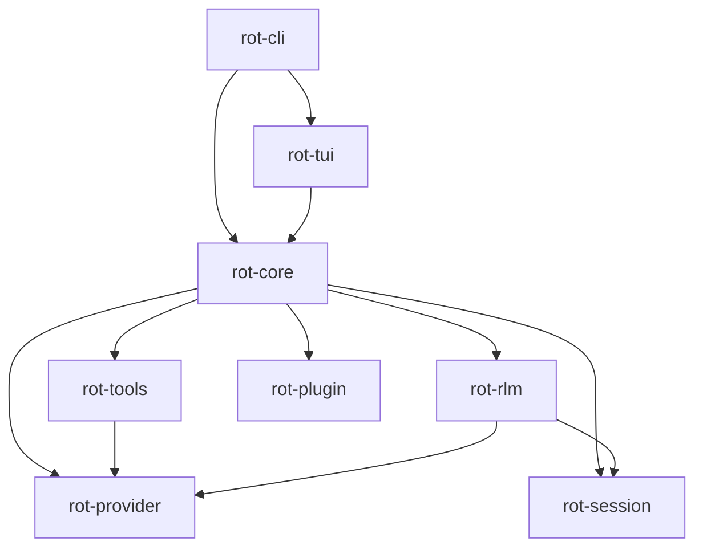

# rot - Technical Architecture

> Recursive Operations Tool - System Design & Implementation Guide

---

## Table of Contents

1. [System Overview](#1-system-overview)
2. [Crate Structure](#2-crate-structure)
3. [Core Abstractions](#3-core-abstractions)
4. [RLM Engine](#4-rlm-engine)
5. [Provider System](#5-provider-system)
6. [Tool System](#6-tool-system)
7. [Session Management](#7-session-management)
8. [TUI Architecture](#8-tui-architecture)
9. [Plugin System](#9-plugin-system)
10. [Data Flow](#10-data-flow)
11. [Technology Stack](#11-technology-stack)
12. [Implementation Phases](#12-implementation-phases)

---

## 1. System Overview

### High-Level Architecture

```
┌─────────────────────────────────────────────────────────────────────────┐
│                              rot CLI                                     │
├────────────────┬─────────────────────┬──────────────────────────────────┤
│                │                     │                                  │
│   TUI Layer    │    Agent Core       │         RLM Engine               │
│   (ratatui)    │                     │                                  │
│                │  ┌───────────────┐  │  ┌────────────────────────────┐  │
│ ┌────────────┐ │  │ Session       │  │  │ External Context Manager   │  │
│ │  Messages  │ │  │ Manager       │  │  │                            │  │
│ │  Widget    │ │  └───────────────┘  │  │  - Prompt storage (files)  │  │
│ ├────────────┤ │  ┌───────────────┐  │  │  - Metadata extraction     │  │
│ │  Editor    │ │  │ Tool          │  │  │  - Chunk tracking          │  │
│ │  Widget    │ │  │ Registry      │  │  └─────────────┬──────────────┘  │
│ ├────────────┤ │  └───────────────┘  │                │                 │
│ │  Status    │ │  ┌───────────────┐  │  ┌─────────────▼──────────────┐  │
│ │  Widget    │ │  │ Message       │  │  │ REPL Environment           │  │
│ └────────────┘ │  │ Builder       │  │  │                            │  │
│                │  └───────────────┘  │  │  - Shell subprocess        │  │
│                │  ┌───────────────┐  │  │  - Code execution          │  │
│                │  │ Permission    │  │  │  - Variable management     │  │
│                │  │ System        │  │  └─────────────┬──────────────┘  │
│                │  └───────────────┘  │                │                 │
│                └──┴────────────────┬─┴──┐ ┌───────────▼───────────────┐  │
│                                   │    │ │ Sub-LLM Orchestrator      │  │
│                                   │    │ │                           │  │
│                                   │    │ │  - Call queue management  │  │
│                                   │    │ │  - Batching support       │  │
│                                   │    │ │  - Result aggregation     │  │
│                                   │    │ └───────────────────────────┘  │
├───────────────────────────────────┴────┴────────────────────────────────┤
│                        Provider Abstraction Layer                        │
│  ┌──────────┐ ┌──────────┐ ┌──────────┐ ┌──────────┐ ┌──────────────┐  │
│  │Anthropic │ │  OpenAI  │ │  Google  │ │  Ollama  │ │ OpenRouter   │  │
│  └──────────┘ └──────────┘ └──────────┘ └──────────┘ └──────────────┘  │
└─────────────────────────────────────────────────────────────────────────┘
```

### Key Design Principles

| Principle                  | Application                                 |
| -------------------------- | ------------------------------------------- |
| **Separation of concerns** | Each crate has a single responsibility      |
| **Async-first**            | All I/O operations are async using Tokio    |
| **Type safety**            | Leverage Rust's type system for correctness |
| **Zero-cost abstractions** | Traits with static dispatch where possible  |
| **Explicit over implicit** | Clear data flow, no hidden magic            |
| **Fail-fast**              | Errors handled immediately with context     |

---

## 2. Crate Structure

### Workspace Layout

```
rot/
├── Cargo.toml                    # Workspace root
├── Cargo.lock
├── README.md
├── LICENSE
├── .gitignore
│
├── crates/
│   ├── rot-cli/                  # Binary entry point
│   │   ├── Cargo.toml
│   │   └── src/
│   │       ├── main.rs           # Entry point
│   │       ├── cli.rs            # CLI argument parsing (clap)
│   │       └── commands/         # Subcommand implementations
│   │           ├── mod.rs
│   │           ├── chat.rs       # Interactive chat
│   │           ├── exec.rs       # Single command execution
│   │           └── session.rs    # Session management
│   │
│   ├── rot-core/                 # Core agent logic
│   │   ├── Cargo.toml
│   │   └── src/
│   │       ├── lib.rs
│   │       ├── agent.rs          # Agent loop implementation
│   │       ├── conversation.rs   # Conversation state (wraps rot-session types)
│   │       ├── message.rs        # Message types
│   │       ├── context.rs        # Context building (maps Messages → ProviderMessages)
│   │       ├── permission.rs     # Permission system
│   │       └── error.rs          # Error types
│   │
│   ├── rot-rlm/                  # RLM implementation
│   │   ├── Cargo.toml
│   │   └── src/
│   │       ├── lib.rs
│   │       ├── engine.rs         # Main RLM engine
│   │       ├── repl.rs           # REPL environment management
│   │       ├── context.rs        # External context storage
│   │       ├── orchestrator.rs   # Sub-LLM orchestration
│   │       ├── chunking.rs       # Chunking strategies
│   │       └── prompts.rs        # RLM system prompts
│   │
│   ├── rot-provider/             # LLM provider abstraction
│   │   ├── Cargo.toml
│   │   └── src/
│   │       ├── lib.rs
│   │       ├── traits.rs         # Provider trait definitions
│   │       ├── types.rs          # Common types (Request, Response, etc.)
│   │       ├── streaming.rs      # SSE/streaming utilities
│   │       └── providers/
│   │           ├── mod.rs
│   │           ├── anthropic.rs
│   │           ├── openai.rs
│   │           ├── google.rs
│   │           ├── ollama.rs
│   │           └── openrouter.rs
│   │
│   ├── rot-tools/                # Built-in tools
│   │   ├── Cargo.toml
│   │   └── src/
│   │       ├── lib.rs
│   │       ├── traits.rs         # Tool trait definitions
│   │       ├── registry.rs       # Tool registry
│   │       ├── schema.rs         # JSON schema generation
│   │       └── builtin/
│   │           ├── mod.rs
│   │           ├── read.rs
│   │           ├── write.rs
│   │           ├── edit.rs
│   │           ├── bash.rs
│   │           ├── glob.rs
│   │           ├── grep.rs
│   │           └── webfetch.rs
│   │
│   ├── rot-tui/                  # Terminal UI
│   │   ├── Cargo.toml
│   │   └── src/
│   │       ├── lib.rs
│   │       ├── app.rs            # Main application state
│   │       ├── event.rs          # Event handling
│   │       ├── widgets/
│   │       │   ├── mod.rs
│   │       │   ├── messages.rs   # Message display
│   │       │   ├── editor.rs     # Input editor
│   │       │   ├── status.rs     # Status bar
│   │       │   └── sidebar.rs    # Optional sidebar
│   │       └── theme.rs          # Theming support
│   │
│   ├── rot-plugin/               # Plugin system
│   │   ├── Cargo.toml
│   │   └── src/
│   │       ├── lib.rs
│   │       ├── traits.rs         # Plugin trait
│   │       ├── registry.rs       # Plugin loading/management
│   │       └── wasm.rs           # WASM runtime (optional)
│   │
│   └── rot-session/              # Session persistence
│       ├── Cargo.toml
│       └── src/
│           ├── lib.rs
│           ├── store.rs          # JSONL storage
│           ├── format.rs         # Session format types
│           └── migration.rs      # Format versioning
│
├── tests/                        # Integration tests
│   ├── integration_test.rs
│   └── fixtures/
│
├── docs/                         # Documentation
│   ├── getting-started.md
│   ├── configuration.md
│   ├── tools.md
│   ├── rlm.md
│   └── plugins.md
│
└── examples/                     # Example plugins/configs
    ├── custom-tool/
    └── custom-provider/
```

### Crate Dependencies



---

## 3. Core Abstractions

### 3.1 Message Types

```rust
// crates/rot-core/src/message.rs

use serde::{Deserialize, Serialize};
use std::time::{SystemTime, UNIX_EPOCH};

/// Unique message identifier
#[derive(Debug, Clone, PartialEq, Eq, Hash, Serialize, Deserialize)]
pub struct MessageId(String);

impl MessageId {
    pub fn new() -> Self {
        Self(ulid::Ulid::new().to_string())
    }
}

/// Message role
#[derive(Debug, Clone, Copy, PartialEq, Eq, Serialize, Deserialize)]
pub enum Role {
    User,
    Assistant,
    Tool,
    System,
}

/// Content block types
#[derive(Debug, Clone, Serialize, Deserialize)]
#[serde(tag = "type")]
pub enum ContentBlock {
    #[serde(rename = "text")]
    Text { text: String },

    #[serde(rename = "image")]
    Image {
        data: String,      // Base64
        mime_type: String,
    },

    #[serde(rename = "tool_call")]
    ToolCall {
        id: String,
        name: String,
        arguments: serde_json::Value,
    },

    #[serde(rename = "tool_result")]
    ToolResult {
        tool_call_id: String,
        tool_name: String,
        content: String,
        is_error: bool,
    },

    #[serde(rename = "thinking")]
    Thinking {
        thinking: String,
        signature: Option<String>,  // For Anthropic
    },
}

/// A single message in the conversation
#[derive(Debug, Clone, Serialize, Deserialize)]
pub struct Message {
    pub id: MessageId,
    pub role: Role,
    pub content: Vec<ContentBlock>,
    pub timestamp: u64,
    pub parent_id: Option<MessageId>,
}

impl Message {
    pub fn user(content: impl Into<String>) -> Self {
        Self {
            id: MessageId::new(),
            role: Role::User,
            content: vec![ContentBlock::Text { text: content.into() }],
            timestamp: SystemTime::now()
                .duration_since(UNIX_EPOCH)
                .unwrap()
                .as_secs(),
            parent_id: None,
        }
    }

    pub fn assistant(content: Vec<ContentBlock>) -> Self {
        Self {
            id: MessageId::new(),
            role: Role::Assistant,
            content,
            timestamp: SystemTime::now()
                .duration_since(UNIX_EPOCH)
                .unwrap()
                .as_secs(),
            parent_id: None,
        }
    }

    pub fn system(content: impl Into<String>) -> Self {
        Self {
            id: MessageId::new(),
            role: Role::System,
            content: vec![ContentBlock::Text { text: content.into() }],
            timestamp: SystemTime::now()
                .duration_since(UNIX_EPOCH)
                .unwrap()
                .as_secs(),
            parent_id: None,
        }
    }

    pub fn to_provider_format(&self) -> ProviderMessage {
        ProviderMessage {
            role: self.role,
            content: self.content.clone(),
        }
    }
}
```

### 3.2 Agent Loop

```rust
// crates/rot-core/src/agent.rs

use crate::{Message, Session, ToolRegistry, Provider, PermissionSystem};
use async_trait::async_trait;
use futures_util::StreamExt;

/// Agent configuration
pub struct AgentConfig {
    pub max_iterations: usize,
    pub max_tokens: usize,
    pub enable_rlm: bool,
    pub rlm_threshold: usize,  // Token count to trigger RLM
}

/// The main agent loop
pub struct Agent {
    provider: Box<dyn Provider>,
    tools: ToolRegistry,
    permissions: PermissionSystem,
    config: AgentConfig,
    rlm_engine: Option<RlmEngine>,
}

impl Agent {
    pub fn new(
        provider: Box<dyn Provider>,
        tools: ToolRegistry,
        config: AgentConfig,
    ) -> Self {
        Self {
            provider,
            tools,
            permissions: PermissionSystem::default(),
            config,
            rlm_engine: None,
        }
    }

    /// Process a user message and return the response
    pub async fn process(
        &mut self,
        session: &mut Session,
        user_input: String,
    ) -> Result<Message, AgentError> {
        // Add user message to session
        let user_msg = Message::user(user_input);
        session.add_message(user_msg.clone());

        // Check if RLM should be activated
        let context_tokens = self.estimate_tokens(session);
        let use_rlm = self.config.enable_rlm
            && context_tokens > self.config.rlm_threshold;

        // Build context for provider
        let context = if use_rlm {
            self.build_rlm_context(session).await?
        } else {
            self.build_standard_context(session)
        };

        // Main agent loop
        let mut iterations = 0;
        loop {
            if iterations >= self.config.max_iterations {
                return Err(AgentError::MaxIterationsExceeded);
            }

            // Stream response from provider
            let mut stream = self.provider.stream(context.clone()).await?;
            let mut current_message = Message::assistant(vec![]);
            let mut tool_calls = Vec::new();

            while let Some(event) = stream.next().await {
                match event? {
                    StreamEvent::TextDelta { delta } => {
                        // Update message with text
                        if let Some(ContentBlock::Text { text }) =
                            current_message.content.last_mut()
                        {
                            text.push_str(&delta);
                        } else {
                            current_message.content.push(
                                ContentBlock::Text { text: delta }
                            );
                        }
                    }

                    StreamEvent::ThinkingDelta { delta } => {
                        current_message.content.push(
                            ContentBlock::Thinking {
                                thinking: delta,
                                signature: None
                            }
                        );
                    }

                    StreamEvent::ToolCallStart { id, name } => {
                        tool_calls.push(PendingToolCall {
                            id,
                            name,
                            arguments: String::new(),
                        });
                    }

                    StreamEvent::ToolCallDelta { id, delta } => {
                        if let Some(tc) = tool_calls.iter_mut()
                            .find(|tc| tc.id == id)
                        {
                            tc.arguments.push_str(&delta);
                        }
                    }

                    StreamEvent::ToolCallEnd { id: _ } => {
                        // Tool call complete
                    }

                    StreamEvent::Done { reason: _ } => {
                        break;
                    }

                    StreamEvent::Error(e) => {
                        return Err(AgentError::ProviderError(e));
                    }
                }
            }

            // Process tool calls if any
            if !tool_calls.is_empty() {
                for tc in tool_calls {
                    let args: serde_json::Value =
                        serde_json::from_str(&tc.arguments)?;

                    // Check permission
                    self.permissions.check(&tc.name, &args)?;

                    // Execute tool
                    let result = self.tools.execute(
                        &tc.name,
                        args,
                        &ToolContext::new(session.working_dir.clone()),
                    ).await?;

                    // Add tool result to message
                    current_message.content.push(ContentBlock::ToolResult {
                        tool_call_id: tc.id.clone(),
                        tool_name: tc.name,
                        content: result.output,
                        is_error: result.is_error,
                    });
                }

                // Add message to session and continue loop
                session.add_message(current_message);
                context.messages = session.to_provider_messages();
                iterations += 1;
                continue;
            }

            // No tool calls - we're done
            session.add_message(current_message.clone());
            return Ok(current_message);
        }
    }

    fn estimate_tokens(&self, session: &Session) -> usize {
        // Simple estimation: ~4 chars per token
        session.messages.iter()
            .map(|m| {
                m.content.iter()
                    .map(|c| match c {
                        ContentBlock::Text { text } => text.len() / 4,
                        _ => 100,
                    })
                    .sum::<usize>()
            })
            .sum()
    }
}
```

---

## 4. RLM Engine

### 4.1 RLM Architecture

```
┌─────────────────────────────────────────────────────────────────┐
│                         RLM Engine                               │
├─────────────────────────────────────────────────────────────────┤
│                                                                  │
│  ┌────────────────┐    ┌────────────────┐    ┌───────────────┐ │
│  │  Input Prompt  │───►│ Context Manager│───►│ External Store│ │
│  │                │    │                │    │ (temp files)  │ │
│  └────────────────┘    └────────────────┘    └───────────────┘ │
│                               │                                  │
│                               ▼                                  │
│  ┌────────────────────────────────────────────────────────────┐│
│  │                    Metadata Builder                         ││
│  │                                                             ││
│  │  - Total length: 1,234,567 chars                           ││
│  │  - Preview (first 500 chars): "..."                        ││
│  │  - Estimated chunks: 124                                    ││
│  │  - Context variables: context_0                             ││
│  └────────────────────────────────────────────────────────────┘│
│                               │                                  │
│                               ▼                                  │
│  ┌────────────────────────────────────────────────────────────┐│
│  │                      RLM Loop                               ││
│  │                                                             ││
│  │  for iteration in 0..max_iterations:                       ││
│  │      1. Build message history (metadata only)              ││
│  │      2. Call LLM with system prompt + history              ││
│  │      3. Extract code blocks from response                  ││
│  │      4. Execute code in REPL                               ││
│  │      5. Check for FINAL or FINAL_VAR                       ││
│  │      6. Update history with code + results                 ││
│  │                                                             ││
│  └────────────────────────────────────────────────────────────┘│
│                               │                                  │
│         ┌─────────────────────┼─────────────────────┐          │
│         ▼                     ▼                     ▼          │
│  ┌─────────────┐      ┌─────────────┐      ┌─────────────┐    │
│  │ llm_query() │      │ rlm_query() │      │  FINAL()    │    │
│  │             │      │             │      │             │    │
│  │ Single call │      │ Recursive   │      │ Return      │    │
│  │ Fast        │      │ Deep think  │      │ answer      │    │
│  └─────────────┘      └─────────────┘      └─────────────┘    │
│                                                                  │
└─────────────────────────────────────────────────────────────────┘
```

### 4.2 RLM Implementation

````rust
// crates/rot-rlm/src/engine.rs

use crate::{ReplEnv, ContextManager, SubLLMOrchestrator};
use rot_provider::{Provider, StreamEvent};
use rot_core::{Message, ContentBlock};
use std::sync::Arc;
use tokio::sync::RwLock;

/// RLM configuration
pub struct RlmConfig {
    pub max_iterations: usize,
    pub max_depth: usize,
    pub max_budget: Option<f64>,
    pub max_timeout: Option<std::time::Duration>,
    pub chunk_size: usize,
    pub sub_llm_model: Option<String>,
}

impl Default for RlmConfig {
    fn default() -> Self {
        Self {
            max_iterations: 30,
            max_depth: 1,
            max_budget: None,
            max_timeout: Some(std::time::Duration::from_secs(300)),
            chunk_size: 50_000,
            sub_llm_model: None,
        }
    }
}

/// The RLM engine
pub struct RlmEngine {
    config: RlmConfig,
    provider: Arc<dyn Provider>,
    repl: ReplEnv,
    context_manager: ContextManager,
    orchestrator: SubLLMOrchestrator,
}

impl RlmEngine {
    pub fn new(config: RlmConfig, provider: Arc<dyn Provider>) -> Self {
        let sub_model = config.sub_llm_model.clone();
        Self {
            config,
            provider: provider.clone(),
            repl: ReplEnv::new(),
            context_manager: ContextManager::new(),
            orchestrator: SubLLMOrchestrator::new(provider, sub_model),
        }
    }

    /// Process a prompt using RLM
    pub async fn process(&mut self, prompt: &str) -> Result<String, RlmError> {
        let start = std::time::Instant::now();

        // 1. Store prompt externally
        let context_var = self.context_manager.store(prompt).await?;

        // 2. Initialize REPL with context
        self.repl.init(&context_var).await?;

        // 3. Register sub-LLM functions
        self.repl.register_function("llm_query", |args| {
            // Single LLM call
        });
        self.repl.register_function("llm_query_batched", |args| {
            // Batched LLM calls
        });
        self.repl.register_function("rlm_query", |args| {
            // Recursive RLM call
        });
        self.repl.register_function("FINAL", |args| {
            // Return final answer
        });
        self.repl.register_function("FINAL_VAR", |args| {
            // Return variable as answer
        });

        // 4. Build metadata message
        let metadata = self.build_metadata(prompt, &context_var);

        // 5. RLM loop
        let mut history = vec![
            Message::system(RLM_SYSTEM_PROMPT),
            Message::user(metadata),
        ];

        for iteration in 0..self.config.max_iterations {
            // Check timeout
            if let Some(timeout) = self.config.max_timeout {
                if start.elapsed() > timeout {
                    return Err(RlmError::Timeout);
                }
            }

            // Get LLM response
            let response = self.provider.complete(history.clone()).await?;

            // Extract code blocks
            let code_blocks = extract_code_blocks(&response, "repl");

            if code_blocks.is_empty() {
                // No code blocks - might be final answer
                if let Some(answer) = extract_final(&response) {
                    return Ok(answer);
                }

                // Ask model to continue with code
                history.push(response);
                history.push(Message::user(
                    "Continue by writing code in ```repl blocks to process the context."
                ));
                continue;
            }

            // Execute code blocks
            let mut iteration_output = String::new();
            for code in &code_blocks {
                let result = self.repl.execute(code).await?;

                // Check for FINAL in stdout
                if let Some(answer) = extract_final_from_output(&result.stdout) {
                    return Ok(answer);
                }

                // Check for FINAL_VAR
                if let Some(var_name) = extract_final_var(&result.stdout) {
                    if let Some(value) = self.repl.get_var(&var_name).await? {
                        return Ok(value);
                    }
                }

                iteration_output.push_str(&result.stdout);
                iteration_output.push_str(&result.stderr);
            }

            // Update history
            history.push(response);
            history.push(Message::user(format!(
                "Code output:\n```\n{}\n```\n\nYour next action:",
                truncate_output(&iteration_output, 5000)
            )));
        }

        // Max iterations reached - generate best effort answer
        let final_prompt = "Based on your analysis, provide the final answer now.";
        history.push(Message::user(final_prompt));
        let final_response = self.provider.complete(history).await?;

        Ok(extract_text_content(&final_response))
    }

    fn build_metadata(&self, prompt: &str, context_var: &str) -> String {
        format!(
            r#"Your context is a string with {} total characters.
It is available as the variable `{}` in your REPL environment.

You can access it by writing code in ```repl blocks.
Use llm_query() for simple tasks, rlm_query() for complex reasoning.
When done, call FINAL(answer) or create a variable and call FINAL_VAR(var_name).

Begin by examining the context structure, then plan your approach."#,
            prompt.len(),
            context_var
        )
    }
}

const RLM_SYSTEM_PROMPT: &str = r#"
You are tasked with answering a query with associated context.
You can access, transform, and analyze this context interactively in a REPL environment
that can recursively query sub-LLMs, which you are strongly encouraged to use.

The REPL environment provides:
1. `context` variable - contains the input context (very important)
2. `llm_query(prompt, model=None)` - single LLM call (fast, one-shot)
3. `llm_query_batched(prompts, model=None)` - concurrent LLM calls
4. `rlm_query(prompt, model=None)` - recursive RLM sub-call (deep thinking)
5. `rlm_query_batched(prompts, model=None)` - parallel recursive calls
6. `SHOW_VARS()` - list available variables
7. `FINAL(answer)` - return final answer
8. `FINAL_VAR(variable_name)` - return a variable as the answer

When to use llm_query vs rlm_query:
- llm_query: Simple extraction, summarization, factual Q&A
- rlm_query: Multi-step reasoning, sub-problems needing iteration

Key patterns:
1. Chunk and query: Break context into chunks, process with llm_query_batched
2. Filter then process: Use regex/code to reduce search space
3. Hierarchical: Summarize sections, then aggregate

Always write code in ```repl blocks. Think step-by-step and execute IMMEDIATELY.
"#;
````

### 4.3 REPL Environment

```rust
// crates/rot-rlm/src/repl.rs

use std::process::{Command, Stdio};
use std::io::{Write, BufRead, BufReader};
use tokio::io::{AsyncReadExt, AsyncWriteExt};
use tokio::process::{Child, ChildStdin, ChildStdout, Command as AsyncCommand};

/// REPL execution result
pub struct ReplResult {
    pub stdout: String,
    pub stderr: String,
    pub exit_code: Option<i32>,
    pub variables: HashMap<String, String>,
}

/// REPL environment using system shell
pub struct ReplEnv {
    shell: String,
    working_dir: PathBuf,
    variables: HashMap<String, String>,
    temp_dir: PathBuf,
}

impl ReplEnv {
    pub fn new() -> Self {
        let temp_dir = std::env::temp_dir().join(format!("rot-repl-{}", ulid::Ulid::new()));
        std::fs::create_dir_all(&temp_dir).ok();

        Self {
            shell: if cfg!(windows) {
                "cmd".to_string()
            } else {
                std::env::var("SHELL").unwrap_or_else(|_| "bash".to_string())
            },
            working_dir: std::env::current_dir().unwrap_or_default(),
            variables: HashMap::new(),
            temp_dir,
        }
    }

    /// Initialize REPL with context variable
    pub async fn init(&mut self, context_path: &str) -> Result<(), RlmError> {
        // For bash, we'll create a script that sets up the environment
        // and provides helper functions
        let setup_script = self.generate_setup_script(context_path);
        let setup_path = self.temp_dir.join("setup.sh");
        tokio::fs::write(&setup_path, &setup_script).await?;

        Ok(())
    }

    /// Execute code in the REPL
    pub async fn execute(&mut self, code: &str) -> Result<ReplResult, RlmError> {
        // Write code to temp file
        let script_path = self.temp_dir.join(format!("exec-{}.sh", ulid::Ulid::new()));
        let full_script = format!(
            "#!/bin/bash\nsource {}\n{}",
            self.temp_dir.join("setup.sh").display(),
            code
        );
        tokio::fs::write(&script_path, &full_script).await?;

        // Execute
        let output = AsyncCommand::new(&self.shell)
            .arg(&script_path)
            .current_dir(&self.working_dir)
            .output()
            .await?;

        let stdout = String::from_utf8_lossy(&output.stdout).to_string();
        let stderr = String::from_utf8_lossy(&output.stderr).to_string();

        // Extract any set variables
        self.extract_variables(&stdout);

        Ok(ReplResult {
            stdout,
            stderr,
            exit_code: output.status.code(),
            variables: self.variables.clone(),
        })
    }

    /// Get a variable value
    pub async fn get_var(&self, name: &str) -> Result<Option<String>, RlmError> {
        Ok(self.variables.get(name).cloned())
    }

    fn generate_setup_script(&self, context_path: &str) -> String {
        format!(r##"
#!/bin/bash

# Context file path
CONTEXT_FILE="{context_path}"

# Helper to get context
get_context() {{
    cat "$CONTEXT_FILE"
}}

# Context preview (first 1000 chars)
context_preview() {{
    head -c 1000 "$CONTEXT_FILE"
}}

# Context length
context_length() {{
    wc -c < "$CONTEXT_FILE"
}}

# LLM query function (calls back to rot)
llm_query() {{
    local prompt="$1"
    local model="${{2:-}}"

    # Call rot's LLM endpoint
    echo "LLM_QUERY:$prompt:END_QUERY"
}}

# Batched LLM query
llm_query_batched() {{
    # Implementation for batched queries
    echo "LLM_BATCHED:$@:END_BATCHED"
}}

# RLM query (recursive)
rlm_query() {{
    local prompt="$1"
    local model="${{2:-}}"

    echo "RLM_QUERY:$prompt:END_QUERY"
}}

# Final answer
FINAL() {{
    echo "FINAL_ANSWER:$1"
    exit 0
}}

# Final answer from variable
FINAL_VAR() {{
    local var_name="$1"
    local value="${{!var_name}}"
    echo "FINAL_VAR:$var_name:$value"
    exit 0
}}

# Show variables
SHOW_VARS() {{
    echo "AVAILABLE_VARS:$(compgen -v | tr '\n' ',')"
}}
"##, context_path = context_path)
    }

    fn extract_variables(&mut self, output: &str) {
        // Parse variable assignments from output
        for line in output.lines() {
            if line.starts_with("VAR_SET:") {
                let parts: Vec<&str> = line[8..].splitn(2, ':').collect();
                if parts.len() == 2 {
                    self.variables.insert(parts[0].to_string(), parts[1].to_string());
                }
            }
        }
    }
}
```

---

## 5. Provider System

### 5.1 Provider Trait

```rust
// crates/rot-provider/src/traits.rs

use async_trait::async_trait;
use futures_util::Stream;
use serde::{Deserialize, Serialize};
use std::pin::Pin;

/// Provider trait for LLM integrations
#[async_trait]
pub trait Provider: Send + Sync {
    /// Provider name
    fn name(&self) -> &str;

    /// List available models
    fn models(&self) -> Vec<ModelInfo>;

    /// Get current model
    fn current_model(&self) -> &str;

    /// Set the model to use
    fn set_model(&mut self, model: &str) -> Result<(), ProviderError>;

    /// Stream a completion
    async fn stream(
        &self,
        request: Request,
    ) -> Result<Pin<Box<dyn Stream<Item = Result<StreamEvent>> + Send>>, ProviderError>;

    /// Complete a request (non-streaming)
    async fn complete(&self, request: Request) -> Result<Response, ProviderError>;

    /// Count tokens in text
    fn count_tokens(&self, text: &str) -> usize;
}

/// Model information
#[derive(Debug, Clone, Serialize, Deserialize)]
pub struct ModelInfo {
    pub id: String,
    pub name: String,
    pub context_window: usize,
    pub max_output_tokens: usize,
    pub supports_vision: bool,
    pub supports_tools: bool,
    pub supports_thinking: bool,
    pub cost_per_input_token: f64,
    pub cost_per_output_token: f64,
}

/// Request to send to provider
#[derive(Debug, Clone, Serialize, Deserialize)]
pub struct Request {
    pub messages: Vec<ProviderMessage>,
    pub tools: Vec<ToolDefinition>,
    pub system: Option<String>,
    pub max_tokens: Option<usize>,
    pub temperature: Option<f32>,
    pub thinking: Option<ThinkingConfig>,
}

/// Message in provider format
#[derive(Debug, Clone, Serialize, Deserialize)]
pub struct ProviderMessage {
    pub role: Role,
    pub content: Vec<ContentBlock>,
}

/// Tool definition for provider
#[derive(Debug, Clone, Serialize, Deserialize)]
pub struct ToolDefinition {
    pub name: String,
    pub description: String,
    pub parameters: serde_json::Value,  // JSON Schema
}

/// Thinking configuration
#[derive(Debug, Clone, Serialize, Deserialize)]
pub struct ThinkingConfig {
    pub enabled: bool,
    pub budget_tokens: Option<usize>,
}

/// Streaming events from provider
#[derive(Debug, Clone)]
pub enum StreamEvent {
    /// Text content delta
    TextDelta { delta: String },

    /// Thinking/reasoning delta
    ThinkingDelta { delta: String },

    /// Tool call started
    ToolCallStart { id: String, name: String },

    /// Tool call arguments delta
    ToolCallDelta { id: String, delta: String },

    /// Tool call completed
    ToolCallEnd { id: String },

    /// Usage information
    Usage { input: usize, output: usize },

    /// Stream complete
    Done { reason: StopReason },

    /// Error occurred
    Error(String),
}

/// Stop reason
#[derive(Debug, Clone, Copy, PartialEq, Eq)]
pub enum StopReason {
    EndTurn,
    ToolUse,
    MaxTokens,
    StopSequence,
    Error,
}

/// Complete response from provider
#[derive(Debug, Clone)]
pub struct Response {
    pub content: Vec<ContentBlock>,
    pub usage: Usage,
    pub stop_reason: StopReason,
}

#[derive(Debug, Clone)]
pub struct Usage {
    pub input_tokens: usize,
    pub output_tokens: usize,
    pub cache_read_tokens: Option<usize>,
    pub cache_write_tokens: Option<usize>,
}
```

### 5.2 Anthropic Provider Example

```rust
// crates/rot-provider/src/providers/anthropic.rs

use crate::{Provider, Request, Response, StreamEvent, ModelInfo, ProviderError};
use async_trait::async_trait;
use futures_util::StreamExt;
use reqwest::Client;
use serde_json::json;

pub struct AnthropicProvider {
    client: Client,
    api_key: String,
    model: String,
    base_url: String,
}

impl AnthropicProvider {
    pub fn new(api_key: String) -> Self {
        Self {
            client: Client::new(),
            api_key,
            model: "claude-sonnet-4-20250514".to_string(),
            base_url: "https://api.anthropic.com".to_string(),
        }
    }

    fn to_anthropic_request(&self, request: Request) -> serde_json::Value {
        let mut messages = Vec::new();

        for msg in request.messages {
            messages.push(json!({
                "role": match msg.role {
                    Role::User => "user",
                    Role::Assistant => "assistant",
                    _ => continue,
                },
                "content": msg.content.iter().map(|c| match c {
                    ContentBlock::Text { text } => json!({
                        "type": "text",
                        "text": text
                    }),
                    ContentBlock::Image { data, mime_type } => json!({
                        "type": "image",
                        "source": {
                            "type": "base64",
                            "media_type": mime_type,
                            "data": data
                        }
                    }),
                    ContentBlock::ToolCall { id, name, arguments } => json!({
                        "type": "tool_use",
                        "id": id,
                        "name": name,
                        "input": arguments
                    }),
                    ContentBlock::ToolResult { tool_call_id, content, is_error, .. } => json!({
                        "type": "tool_result",
                        "tool_use_id": tool_call_id,
                        "content": content,
                        "is_error": is_error
                    }),
                    _ => json!(null)
                }).collect::<Vec<_>>()
            }));
        }

        let mut body = json!({
            "model": self.model,
            "messages": messages,
            "max_tokens": request.max_tokens.unwrap_or(4096),
        });

        if !request.tools.is_empty() {
            body["tools"] = json!(request.tools.iter().map(|t| json!({
                "name": t.name,
                "description": t.description,
                "input_schema": t.parameters
            })).collect::<Vec<_>>());
        }

        if let Some(system) = request.system {
            body["system"] = json!(system);
        }

        if let Some(thinking) = request.thinking {
            if thinking.enabled {
                body["thinking"] = json!({
                    "type": "enabled",
                    "budget_tokens": thinking.budget_tokens.unwrap_or(8192)
                });
            }
        }

        body
    }
}

#[async_trait]
impl Provider for AnthropicProvider {
    fn name(&self) -> &str {
        "anthropic"
    }

    fn models(&self) -> Vec<ModelInfo> {
        vec![
            ModelInfo {
                id: "claude-sonnet-4-20250514".to_string(),
                name: "Claude Sonnet 4".to_string(),
                context_window: 200_000,
                max_output_tokens: 16_384,
                supports_vision: true,
                supports_tools: true,
                supports_thinking: true,
                cost_per_input_token: 0.000003,
                cost_per_output_token: 0.000015,
            },
            ModelInfo {
                id: "claude-3-5-sonnet-20241022".to_string(),
                name: "Claude 3.5 Sonnet".to_string(),
                context_window: 200_000,
                max_output_tokens: 8_192,
                supports_vision: true,
                supports_tools: true,
                supports_thinking: false,
                cost_per_input_token: 0.000003,
                cost_per_output_token: 0.000015,
            },
        ]
    }

    fn current_model(&self) -> &str {
        &self.model
    }

    fn set_model(&mut self, model: &str) -> Result<(), ProviderError> {
        if self.models().iter().any(|m| m.id == model) {
            self.model = model.to_string();
            Ok(())
        } else {
            Err(ProviderError::InvalidModel(model.to_string()))
        }
    }

    async fn stream(
        &self,
        request: Request,
    ) -> Result<Pin<Box<dyn Stream<Item = Result<StreamEvent>> + Send>>, ProviderError> {
        let body = self.to_anthropic_request(request);

        let response = self.client
            .post(format!("{}/v1/messages", self.base_url))
            .header("x-api-key", &self.api_key)
            .header("anthropic-version", "2023-06-01")
            .header("content-type", "application/json")
            .json(&body)
            .send()
            .await?;

        if !response.status().is_success() {
            let error = response.text().await?;
            return Err(ProviderError::ApiError(error));
        }

        // Parse SSE stream
        let stream = response.bytes_stream()
            .map(|chunk| {
                let chunk = chunk?;
                let text = String::from_utf8_lossy(&chunk);

                // Parse SSE events
                let mut events = Vec::new();
                for line in text.lines() {
                    if line.starts_with("data: ") {
                        let data = &line[6..];
                        if let Ok(event) = serde_json::from_str::<AnthropicStreamEvent>(data) {
                            events.push(self.parse_stream_event(event));
                        }
                    }
                }

                Ok(events)
            })
            .flat_map(|events| futures_util::stream::iter(events.unwrap_or_default()));

        Ok(Box::pin(stream))
    }

    async fn complete(&self, request: Request) -> Result<Response, ProviderError> {
        let mut stream = self.stream(request).await?;
        let mut content = Vec::new();
        let mut usage = Usage {
            input_tokens: 0,
            output_tokens: 0,
            cache_read_tokens: None,
            cache_write_tokens: None,
        };
        let mut stop_reason = StopReason::EndTurn;

        while let Some(event) = stream.next().await {
            match event? {
                StreamEvent::TextDelta { delta } => {
                    if let Some(ContentBlock::Text { text }) = content.last_mut() {
                        text.push_str(&delta);
                    } else {
                        content.push(ContentBlock::Text { text: delta });
                    }
                }
                StreamEvent::Done { reason } => {
                    stop_reason = reason;
                    break;
                }
                StreamEvent::Usage { input, output } => {
                    usage.input_tokens = input;
                    usage.output_tokens = output;
                }
                _ => {}
            }
        }

        Ok(Response {
            content,
            usage,
            stop_reason,
        })
    }

    fn count_tokens(&self, text: &str) -> usize {
        // Approximate: ~4 chars per token
        text.len() / 4
    }
}
```

---

## 6. Tool System

### 6.1 Tool Trait

```rust
// crates/rot-tools/src/traits.rs

use async_trait::async_trait;
use schemars::JsonSchema;
use serde::{Deserialize, Serialize};
use std::path::PathBuf;

/// Tool execution context
pub struct ToolContext {
    pub working_dir: PathBuf,
    pub session_id: String,
    pub timeout: std::time::Duration,
}

/// Tool result
#[derive(Debug, Clone)]
pub struct ToolResult {
    pub output: String,
    pub metadata: serde_json::Value,
    pub is_error: bool,
    pub attachments: Vec<Attachment>,
}

#[derive(Debug, Clone)]
pub struct Attachment {
    pub data: Vec<u8>,
    pub mime_type: String,
    pub filename: Option<String>,
}

/// Tool trait
#[async_trait]
pub trait Tool: Send + Sync {
    /// Tool name (used by LLM)
    fn name(&self) -> &str;

    /// Human-readable label
    fn label(&self) -> &str;

    /// Description for LLM
    fn description(&self) -> &str;

    /// JSON Schema for parameters
    fn parameters_schema(&self) -> serde_json::Value;

    /// Execute the tool
    async fn execute(
        &self,
        args: serde_json::Value,
        ctx: &ToolContext,
    ) -> Result<ToolResult, ToolError>;
}

/// Helper macro to define tools with typed parameters
#[macro_export]
macro_rules! define_tool {
    ($struct_name:ident, $name:literal, $label:literal, $description:literal, $params:ty, $execute:expr) => {
        pub struct $struct_name;

        #[async_trait::async_trait]
        impl Tool for $struct_name {
            fn name(&self) -> &str { $name }
            fn label(&self) -> &str { $label }
            fn description(&self) -> &str { $description }

            fn parameters_schema(&self) -> serde_json::Value {
                serde_json::to_value(schemars::schema_for!($params))
                    .expect("schema serialization should not fail")
            }

            async fn execute(
                &self,
                args: serde_json::Value,
                ctx: &ToolContext,
            ) -> Result<ToolResult, ToolError> {
                let params: $params = serde_json::from_value(args)
                    .map_err(|e| ToolError::InvalidParameters(e.to_string()))?;
                $execute(params, ctx).await
            }
        }
    };
}
```

### 6.2 Built-in Tools

```rust
// crates/rot-tools/src/builtin/read.rs

use crate::{Tool, ToolContext, ToolResult, ToolError};
use async_trait::async_trait;
use schemars::JsonSchema;
use serde::{Deserialize, Serialize};
use std::path::Path;

#[derive(Debug, Serialize, Deserialize, JsonSchema)]
pub struct ReadParams {
    /// Path to the file to read
    pub path: String,

    /// Line offset to start reading from (1-indexed)
    #[serde(default)]
    pub offset: Option<usize>,

    /// Maximum number of lines to read
    #[serde(default = "default_limit")]
    pub limit: usize,
}

fn default_limit() -> usize { 2000 }

pub struct ReadTool;

#[async_trait]
impl Tool for ReadTool {
    fn name(&self) -> &str { "read" }
    fn label(&self) -> &str { "Read File" }
    fn description(&self) -> &str {
        "Read a file's contents. Use offset and limit for large files. \
         Returns up to 2000 lines by default."
    }

    fn parameters_schema(&self) -> serde_json::Value {
        serde_json::to_value(schemars::schema_for!(ReadParams))
            .expect("schema serialization should not fail")
    }

    async fn execute(
        &self,
        args: serde_json::Value,
        ctx: &ToolContext,
    ) -> Result<ToolResult, ToolError> {
        let params: ReadParams = serde_json::from_value(args)
            .map_err(|e| ToolError::InvalidParameters(e.to_string()))?;

        let path = ctx.working_dir.join(&params.path);

        // Security check
        if !path.starts_with(&ctx.working_dir) {
            return Err(ToolError::PermissionDenied(
                "Cannot read files outside working directory".to_string()
            ));
        }

        // Read file
        let content = tokio::fs::read_to_string(&path).await
            .map_err(|e| ToolError::ExecutionError(e.to_string()))?;

        let lines: Vec<&str> = content.lines().collect();
        let total_lines = lines.len();

        let offset = params.offset.unwrap_or(1).saturating_sub(1);
        let end = (offset + params.limit).min(total_lines);

        let selected_lines = &lines[offset..end];
        let output = selected_lines.join("\n");

        // Truncate if too large
        let (output, truncated) = if output.len() > 50_000 {
            (&output[..50_000], true)
        } else {
            (&output[..], false)
        };

        Ok(ToolResult {
            output: format!(
                "File: {} (lines {}-{} of {})\n{}\n{}",
                params.path,
                offset + 1,
                end,
                total_lines,
                "─".repeat(50),
                output
            ),
            metadata: serde_json::json!({
                "path": params.path,
                "total_lines": total_lines,
                "offset": offset + 1,
                "limit": params.limit,
                "truncated": truncated,
            }),
            is_error: false,
            attachments: vec![],
        })
    }
}
```

```rust
// crates/rot-tools/src/builtin/bash.rs

use crate::{Tool, ToolContext, ToolResult, ToolError};
use async_trait::async_trait;
use schemars::JsonSchema;
use serde::{Deserialize, Serialize};
use tokio::process::Command;

#[derive(Debug, Serialize, Deserialize, JsonSchema)]
pub struct BashParams {
    /// Command to execute
    pub command: String,

    /// Timeout in seconds
    #[serde(default = "default_timeout")]
    pub timeout: u64,

    /// Working directory (relative to project root)
    #[serde(default)]
    pub cwd: Option<String>,
}

fn default_timeout() -> u64 { 120 }

pub struct BashTool;

#[async_trait]
impl Tool for BashTool {
    fn name(&self) -> &str { "bash" }
    fn label(&self) -> &str { "Execute Command" }
    fn description(&self) -> &str {
        "Execute a shell command. Use for running tests, git operations, \
         building projects, etc. Commands timeout after 120 seconds by default."
    }

    fn parameters_schema(&self) -> serde_json::Value {
        serde_json::to_value(schemars::schema_for!(BashParams))
            .expect("schema serialization should not fail")
    }

    async fn execute(
        &self,
        args: serde_json::Value,
        ctx: &ToolContext,
    ) -> Result<ToolResult, ToolError> {
        let params: BashParams = serde_json::from_value(args)
            .map_err(|e| ToolError::InvalidParameters(e.to_string()))?;

        let cwd = params.cwd
            .map(|c| ctx.working_dir.join(c))
            .unwrap_or_else(|| ctx.working_dir.clone());

        let shell = if cfg!(windows) { "cmd" } else { "bash" };
        let flag = if cfg!(windows) { "/C" } else { "-c" };

        let output = Command::new(shell)
            .arg(flag)
            .arg(&params.command)
            .current_dir(&cwd)
            .output()
            .await
            .map_err(|e| ToolError::ExecutionError(e.to_string()))?;

        let stdout = String::from_utf8_lossy(&output.stdout);
        let stderr = String::from_utf8_lossy(&output.stderr);

        let mut combined = String::new();
        if !stdout.is_empty() {
            combined.push_str(&stdout);
        }
        if !stderr.is_empty() {
            if !combined.is_empty() {
                combined.push_str("\n");
            }
            combined.push_str("stderr:\n");
            combined.push_str(&stderr);
        }

        let is_error = !output.status.success();

        // Truncate output
        let truncated = combined.len() > 50_000;
        if truncated {
            combined = combined[..50_000].to_string();
            combined.push_str("\n... (output truncated)");
        }

        Ok(ToolResult {
            output: combined,
            metadata: serde_json::json!({
                "command": params.command,
                "exit_code": output.status.code(),
                "truncated": truncated,
            }),
            is_error,
            attachments: vec![],
        })
    }
}
```

---

## 7. Session Management

### 7.1 Session Format (JSONL)

```rust
// crates/rot-session/src/format.rs

use serde::{Deserialize, Serialize};
use std::time::{SystemTime, UNIX_EPOCH};

/// Session entry types
#[derive(Debug, Clone, Serialize, Deserialize)]
#[serde(tag = "type")]
pub enum SessionEntry {
    #[serde(rename = "session/start")]
    SessionStart {
        id: String,
        timestamp: u64,
        cwd: String,
        model: String,
        provider: String,
    },

    #[serde(rename = "message")]
    Message {
        id: String,
        parent_id: Option<String>,
        timestamp: u64,
        role: String,
        content: Vec<ContentBlock>,
    },

    #[serde(rename = "tool_call")]
    ToolCall {
        id: String,
        parent_id: String,
        timestamp: u64,
        name: String,
        arguments: serde_json::Value,
    },

    #[serde(rename = "tool_result")]
    ToolResult {
        id: String,
        call_id: String,
        timestamp: u64,
        output: String,
        is_error: bool,
    },

    #[serde(rename = "compaction")]
    Compaction {
        id: String,
        timestamp: u64,
        summary: String,
        first_kept_id: String,
    },

    #[serde(rename = "branch")]
    Branch {
        id: String,
        from_id: String,
        timestamp: u64,
        label: Option<String>,
    },
}

/// Session metadata
#[derive(Debug, Clone, Serialize, Deserialize)]
pub struct SessionMeta {
    pub id: String,
    pub created_at: u64,
    pub updated_at: u64,
    pub title: Option<String>,
    pub cwd: String,
    pub model: String,
    pub provider: String,
    pub message_count: usize,
}
```

### 7.2 Session Store

```rust
// crates/rot-session/src/store.rs

use crate::format::{SessionEntry, SessionMeta};
use std::path::{Path, PathBuf};
use tokio::fs::{File, OpenOptions};
use tokio::io::{AsyncBufReadExt, AsyncWriteExt, BufReader, BufWriter};

pub struct SessionStore {
    sessions_dir: PathBuf,
}

impl SessionStore {
    pub fn new(sessions_dir: PathBuf) -> Self {
        Self { sessions_dir }
    }

    pub fn default_path() -> PathBuf {
        dirs::data_dir()
            .unwrap_or_else(|| PathBuf::from("."))
            .join("rot")
            .join("sessions")
    }

    /// Create a new session
    pub async fn create(
        &self,
        cwd: &Path,
        model: &str,
        provider: &str,
    ) -> Result<Session, SessionError> {
        let id = ulid::Ulid::new().to_string();
        let timestamp = SystemTime::now()
            .duration_since(UNIX_EPOCH)
            .unwrap()
            .as_secs();

        // Create session directory based on cwd hash
        let cwd_hash = blake3::hash(cwd.to_string_lossy().as_bytes());
        let session_dir = self.sessions_dir
            .join(format!("{:x}", cwd_hash));

        tokio::fs::create_dir_all(&session_dir).await?;

        let session_file = session_dir.join(format!("{}.jsonl", id));
        let file = OpenOptions::new()
            .create_new(true)
            .write(true)
            .open(&session_file)
            .await?;

        let mut writer = BufWriter::new(file);

        // Write session start entry
        let start_entry = SessionEntry::SessionStart {
            id: id.clone(),
            timestamp,
            cwd: cwd.to_string_lossy().to_string(),
            model: model.to_string(),
            provider: provider.to_string(),
        };

        writer.write_all(serde_json::to_string(&start_entry)?.as_bytes()).await?;
        writer.write_all(b"\n").await?;
        writer.flush().await?;

        Ok(Session {
            id,
            file_path: session_file,
            cwd: cwd.to_path_buf(),
            model: model.to_string(),
            provider: provider.to_string(),
            entries: vec![start_entry],
            current_leaf: id.clone(),
        })
    }

    /// Load a session by ID
    pub async fn load(&self, id: &str) -> Result<Session, SessionError> {
        // Search for session file
        let session_file = self.find_session_file(id).await?
            .ok_or(SessionError::NotFound(id.to_string()))?;

        let file = File::open(&session_file).await?;
        let reader = BufReader::new(file);
        let mut lines = reader.lines();

        let mut entries = Vec::new();
        let mut current_leaf = None;

        while let Some(line) = lines.next_line().await? {
            if let Ok(entry) = serde_json::from_str::<SessionEntry>(&line) {
                if let SessionEntry::SessionStart { .. } = &entry {
                    current_leaf = Some(get_entry_id(&entry).to_string());
                } else {
                    current_leaf = Some(get_entry_id(&entry).to_string());
                }
                entries.push(entry);
            }
        }

        // Parse session start
        let (cwd, model, provider) = match &entries.first() {
            Some(SessionEntry::SessionStart { cwd, model, provider, .. }) => {
                (PathBuf::from(cwd), model.clone(), provider.clone())
            }
            _ => return Err(SessionError::InvalidFormat("Missing session start".into())),
        };

        Ok(Session {
            id: id.to_string(),
            file_path: session_file,
            cwd,
            model,
            provider,
            entries,
            current_leaf: current_leaf.unwrap_or_else(|| id.to_string()),
        })
    }

    /// Append an entry to a session
    pub async fn append(
        &self,
        session: &mut Session,
        entry: SessionEntry,
    ) -> Result<(), SessionError> {
        let file = OpenOptions::new()
            .append(true)
            .open(&session.file_path)
            .await?;

        let mut writer = BufWriter::new(file);
        writer.write_all(serde_json::to_string(&entry)?.as_bytes()).await?;
        writer.write_all(b"\n").await?;
        writer.flush().await?;

        session.current_leaf = get_entry_id(&entry).to_string();
        session.entries.push(entry);

        Ok(())
    }

    /// List recent sessions
    pub async fn list_recent(&self, limit: usize) -> Result<Vec<SessionMeta>, SessionError> {
        let mut sessions = Vec::new();

        let mut entries = tokio::fs::read_dir(&self.sessions_dir).await?;
        while let Some(entry) = entries.next_entry().await? {
            if entry.file_type().await?.is_dir() {
                let mut files = tokio::fs::read_dir(entry.path()).await?;
                while let Some(file) = files.next_entry().await? {
                    if file.path().extension().map(|e| e == "jsonl").unwrap_or(false) {
                        if let Ok(meta) = self.read_meta(&file.path()).await {
                            sessions.push(meta);
                        }
                    }
                }
            }
        }

        // Sort by updated_at descending
        sessions.sort_by(|a, b| b.updated_at.cmp(&a.updated_at));
        sessions.truncate(limit);

        Ok(sessions)
    }
}

fn get_entry_id(entry: &SessionEntry) -> &str {
    match entry {
        SessionEntry::SessionStart { id, .. } => id,
        SessionEntry::Message { id, .. } => id,
        SessionEntry::ToolCall { id, .. } => id,
        SessionEntry::ToolResult { id, .. } => id,
        SessionEntry::Compaction { id, .. } => id,
        SessionEntry::Branch { id, .. } => id,
    }
}
```

---

## 8. TUI Architecture

### 8.1 Application State

```rust
// crates/rot-tui/src/app.rs

use crate::widgets::{MessagesWidget, EditorWidget, StatusWidget};
use crossterm::event::{Event, KeyCode, KeyModifiers};
use ratatui::{Frame, layout::{Constraint, Direction, Layout, Rect}};

pub struct App {
    /// Application state
    pub state: AppState,

    /// Messages widget
    pub messages: MessagesWidget,

    /// Input editor
    pub editor: EditorWidget,

    /// Status bar
    pub status: StatusWidget,

    /// Is the app running?
    pub running: bool,

    /// Current input mode
    pub input_mode: InputMode,
}

#[derive(Debug, Clone, Copy, PartialEq, Eq)]
pub enum AppState {
    Idle,
    Thinking,
    Streaming,
    Error,
}

#[derive(Debug, Clone, Copy, PartialEq, Eq)]
pub enum InputMode {
    Normal,
    Insert,
    Command,
}

impl App {
    pub fn new() -> Self {
        Self {
            state: AppState::Idle,
            messages: MessagesWidget::new(),
            editor: EditorWidget::new(),
            status: StatusWidget::new(),
            running: true,
            input_mode: InputMode::Insert,
        }
    }

    /// Handle terminal event
    pub fn handle_event(&mut self, event: Event) {
        match event {
            Event::Key(key) => {
                match self.input_mode {
                    InputMode::Normal => self.handle_normal_key(key),
                    InputMode::Insert => self.handle_insert_key(key),
                    InputMode::Command => self.handle_command_key(key),
                }
            }
            Event::Resize(width, height) => {
                // Handle resize
            }
            _ => {}
        }
    }

    fn handle_insert_key(&mut self, key: crossterm::event::KeyEvent) {
        match (key.modifiers, key.code) {
            (KeyModifiers::CONTROL, KeyCode::Char('c')) => {
                if self.state == AppState::Idle {
                    self.running = false;
                } else {
                    // Cancel current operation
                    self.state = AppState::Idle;
                }
            }
            (KeyModifiers::NONE, KeyCode::Enter) => {
                if !self.editor.is_empty() {
                    self.submit_input();
                }
            }
            (KeyModifiers::NONE, KeyCode::Esc) => {
                self.input_mode = InputMode::Normal;
            }
            _ => {
                self.editor.handle_key(key);
            }
        }
    }

    fn handle_normal_key(&mut self, key: crossterm::event::KeyEvent) {
        match key.code {
            KeyCode::Char('i') => self.input_mode = InputMode::Insert,
            KeyCode::Char(':') => self.input_mode = InputMode::Command,
            KeyCode::Char('q') => self.running = false,
            KeyCode::Up => self.messages.scroll_up(),
            KeyCode::Down => self.messages.scroll_down(),
            _ => {}
        }
    }

    fn submit_input(&mut self) {
        let input = self.editor.take_input();
        if !input.is_empty() {
            // Add user message
            self.messages.add_user_message(input.clone());

            // Trigger agent processing
            self.state = AppState::Thinking;

            // In real implementation, this would send to agent
            // via a channel
        }
    }

    /// Render the TUI
    pub fn render(&mut self, frame: &mut Frame) {
        let chunks = Layout::default()
            .direction(Direction::Vertical)
            .constraints([
                Constraint::Min(3),      // Messages
                Constraint::Length(3),   // Editor
                Constraint::Length(1),   // Status
            ])
            .split(frame.area());

        // Render messages
        self.messages.render(frame, chunks[0]);

        // Render editor
        self.editor.render(frame, chunks[1], self.input_mode == InputMode::Insert);

        // Render status
        self.status.render(frame, chunks[2], &self.state);
    }
}
```

### 8.2 Message Widget

```rust
// crates/rot-tui/src/widgets/messages.rs

use ratatui::{
    Frame,
    layout::Rect,
    style::{Color, Modifier, Style},
    text::{Line, Span, Text},
    widgets::{Block, Borders, Paragraph, Scrollbar, ScrollbarOrientation},
};
use std::collections::VecDeque;

pub struct MessagesWidget {
    messages: VecDeque<MessageView>,
    scroll: u16,
    max_messages: usize,
}

struct MessageView {
    role: Role,
    content: String,
    timestamp: u64,
}

enum Role {
    User,
    Assistant,
    Tool,
    Error,
}

impl MessagesWidget {
    pub fn new() -> Self {
        Self {
            messages: VecDeque::with_capacity(100),
            scroll: 0,
            max_messages: 500,
        }
    }

    pub fn add_user_message(&mut self, content: String) {
        self.add_message(Role::User, content);
    }

    pub fn add_assistant_message(&mut self, content: String) {
        self.add_message(Role::Assistant, content);
    }

    pub fn add_tool_result(&mut self, tool_name: &str, result: &str, is_error: bool) {
        let role = if is_error { Role::Error } else { Role::Tool };
        self.add_message(role, format!("{}: {}", tool_name, result));
    }

    fn add_message(&mut self, role: Role, content: String) {
        while self.messages.len() >= self.max_messages {
            self.messages.pop_front();
        }

        self.messages.push_back(MessageView {
            role,
            content,
            timestamp: std::time::SystemTime::now()
                .duration_since(std::time::UNIX_EPOCH)
                .unwrap()
                .as_secs(),
        });
    }

    pub fn scroll_up(&mut self) {
        if self.scroll > 0 {
            self.scroll -= 1;
        }
    }

    pub fn scroll_down(&mut self) {
        self.scroll += 1;
    }

    pub fn render(&mut self, frame: &mut Frame, area: Rect) {
        let mut lines = Vec::new();

        for msg in &self.messages {
            let (prefix, style) = match msg.role {
                Role::User => ("You", Style::default().fg(Color::Blue)),
                Role::Assistant => ("rot", Style::default().fg(Color::Green)),
                Role::Tool => ("Tool", Style::default().fg(Color::Yellow)),
                Role::Error => ("Error", Style::default().fg(Color::Red)),
            };

            lines.push(Line::from(vec![
                Span::styled(format!("[{}] ", prefix), style.add_modifier(Modifier::BOLD)),
            ]));

            for line in msg.content.lines() {
                lines.push(Line::from(line.to_string()));
            }

            lines.push(Line::from(""));  // Empty line between messages
        }

        let paragraph = Paragraph::new(Text::from(lines))
            .block(Block::default()
                .borders(Borders::ALL)
                .title(" Messages "));

        frame.render_widget(paragraph, area);
    }
}
```

---

## 9. Plugin System

> [!NOTE]
> Plugin support is a **v2.0** feature. This section defines the planned interfaces
> so the core architecture remains extension-ready.

### 9.1 Plugin Trait

```rust
// crates/rot-plugin/src/traits.rs

use async_trait::async_trait;
use rot_core::Message;
use rot_tools::{Tool, ToolContext, ToolResult};
use std::collections::HashMap;

/// Plugin lifecycle hooks
#[async_trait]
pub trait Plugin: Send + Sync {
    /// Plugin name
    fn name(&self) -> &str;

    /// Plugin version
    fn version(&self) -> &str {
        "0.1.0"
    }

    /// Called when plugin is loaded
    async fn on_load(&mut self, _ctx: &PluginContext) -> Result<(), PluginError> {
        Ok(())
    }

    /// Called when plugin is unloaded
    async fn on_unload(&mut self) -> Result<(), PluginError> {
        Ok(())
    }

    /// Provide custom tools
    fn tools(&self) -> Vec<Box<dyn Tool>> {
        vec![]
    }

    /// Hook: before agent starts processing
    async fn on_agent_start(&mut self, _ctx: &AgentContext) -> Result<(), PluginError> {
        Ok(())
    }

    /// Hook: before tool execution
    async fn on_tool_before(
        &mut self,
        _tool_name: &str,
        _args: &serde_json::Value,
    ) -> Result<Option<ToolResult>, PluginError> {
        Ok(None)  // None = continue with normal execution
    }

    /// Hook: after tool execution
    async fn on_tool_after(
        &mut self,
        _tool_name: &str,
        _result: &ToolResult,
    ) -> Result<(), PluginError> {
        Ok(())
    }

    /// Hook: modify context before sending to LLM
    async fn on_context_build(
        &mut self,
        _messages: &mut Vec<Message>,
    ) -> Result<(), PluginError> {
        Ok(())
    }
}

/// Plugin context
pub struct PluginContext {
    pub config_dir: std::path::PathBuf,
    pub data_dir: std::path::PathBuf,
}

/// Agent context for hooks
pub struct AgentContext {
    pub session_id: String,
    pub working_dir: std::path::PathBuf,
    pub model: String,
    pub provider: String,
}
```

### 9.2 Plugin Registry

```rust
// crates/rot-plugin/src/registry.rs

use crate::{Plugin, PluginContext, PluginError};
use std::collections::HashMap;
use std::sync::Arc;
use tokio::sync::RwLock;

pub struct PluginRegistry {
    plugins: HashMap<String, Box<dyn Plugin>>,
    tools: HashMap<String, Arc<dyn Tool>>,
}

impl PluginRegistry {
    pub fn new() -> Self {
        Self {
            plugins: HashMap::new(),
            tools: HashMap::new(),
        }
    }

    /// Register a plugin
    pub async fn register(
        &mut self,
        mut plugin: Box<dyn Plugin>,
        ctx: &PluginContext,
    ) -> Result<(), PluginError> {
        plugin.on_load(ctx).await?;

        // Collect tools from plugin
        let name = plugin.name().to_string();
        for tool in plugin.tools() {
            self.tools.insert(tool.name().to_string(), Arc::from(tool));
        }

        self.plugins.insert(name, plugin);
        Ok(())
    }

    /// Unregister a plugin
    pub async fn unregister(&mut self, name: &str) -> Result<(), PluginError> {
        if let Some(mut plugin) = self.plugins.remove(name) {
            plugin.on_unload().await?;
        }
        Ok(())
    }

    /// Get all registered tools
    pub fn tools(&self) -> Vec<Arc<dyn Tool>> {
        self.tools.values().cloned().collect()
    }

    /// Get a specific plugin
    pub fn get(&self, name: &str) -> Option<&Box<dyn Plugin>> {
        self.plugins.get(name)
    }
}
```

---

## 10. Data Flow

### 10.1 Message Processing Flow

```
User Input
    │
    ▼
┌─────────────────┐
│   TUI Editor    │
└────────┬────────┘
         │
         ▼
┌─────────────────┐
│  App::submit()  │──────► Add to MessagesWidget
└────────┬────────┘
         │
         ▼
┌─────────────────┐
│  Create Message │
│  (User role)    │
└────────┬────────┘
         │
         ▼
┌─────────────────┐
│ Session::append │──────► Write to JSONL file
└────────┬────────┘
         │
         ▼
┌─────────────────┐
│ Estimate tokens │
└────────┬────────┘
         │
         ├─── tokens < threshold ──────────────────┐
         │                                         │
         ▼                                         ▼
┌─────────────────┐                     ┌─────────────────┐
│ RLM Activation  │                     │ Standard Flow   │
│ (if > 50k)      │                     │                 │
└────────┬────────┘                     └────────┬────────┘
         │                                       │
         ▼                                       ▼
┌─────────────────┐                     ┌─────────────────┐
│ Store context   │                     │ Build context   │
│ externally      │                     │ in memory       │
└────────┬────────┘                     └────────┬────────┘
         │                                       │
         ▼                                       │
┌─────────────────┐                              │
│ RLM Loop        │                              │
│ (see RLM section)│                             │
└────────┬────────┘                              │
         │                                       │
         └───────────────────────────────────────┘
                         │
                         ▼
               ┌─────────────────┐
               │ Provider::stream│
               └────────┬────────┘
                        │
         ┌──────────────┼──────────────┐
         ▼              ▼              ▼
    TextDelta     ToolCallStart   ThinkingDelta
         │              │              │
         ▼              ▼              ▼
    ┌─────────┐   ┌─────────┐   ┌─────────┐
    │ Update  │   │ Queue   │   │ Update  │
    │ TUI     │   │ tool    │   │ TUI     │
    │ live    │   │ call    │   │ (hidden)│
    └─────────┘   └────┬────┘   └─────────┘
                       │
                       ▼
              ┌─────────────────┐
              │ Tool execution  │
              │ (with permission│
              │  check)         │
              └────────┬────────┘
                       │
                       ▼
              ┌─────────────────┐
              │ Add ToolResult  │
              │ to context      │
              └────────┬────────┘
                       │
                       ▼
              ┌─────────────────┐
              │ Continue loop   │
              │ (if more tools) │
              └─────────────────┘
```

### 10.2 RLM Execution Flow

```
Large Context (> 50k tokens)
         │
         ▼
┌─────────────────────────┐
│ RLMEngine::process()    │
└────────────┬────────────┘
             │
             ▼
┌─────────────────────────┐
│ ContextManager::store() │──────► Write to temp file
└────────────┬────────────┘
             │
             ▼
┌─────────────────────────┐
│ ReplEnv::init()         │──────► Set up shell env
└────────────┬────────────┘
             │
             ▼
┌─────────────────────────┐
│ Build metadata message  │
│ (length, preview only)  │
└────────────┬────────────┘
             │
             ▼
    ┌────────────────┐
    │ RLM Loop       │◄────────────────────────┐
    └────────┬───────┘                         │
             │                                 │
             ▼                                 │
    ┌────────────────┐                         │
    │ LLM completion │                         │
    └────────┬───────┘                         │
             │                                 │
    ┌────────┴────────┐                        │
    │                 │                        │
    ▼                 ▼                        │
Code blocks      No code                       │
    │                 │                        │
    ▼                 ▼                        │
┌───────────┐   ┌───────────┐                  │
│ Execute   │   │ Extract   │                  │
│ in REPL   │   │ FINAL     │────► Return      │
└─────┬─────┘   └───────────┘                  │
      │                                        │
      ├──► llm_query() ──► Sub-LLM call        │
      │                                        │
      ├──► rlm_query() ──► Recursive RLM      │
      │                                        │
      ▼                                        │
┌───────────┐                                  │
│ Check for │                                  │
│ FINAL     │──────► No ──────────────────────┘
└─────┬─────┘
      │
      ▼ Yes
┌───────────┐
│ Return    │
│ answer    │
└───────────┘
```

---

## 11. Technology Stack

### 11.1 Core Dependencies

```toml
# Cargo.toml (workspace)

[workspace]
members = [
    "crates/rot-cli",
    "crates/rot-core",
    "crates/rot-rlm",
    "crates/rot-provider",
    "crates/rot-tools",
    "crates/rot-tui",
    "crates/rot-plugin",
    "crates/rot-session",
]
resolver = "2"

[workspace.package]
version = "0.1.0"
edition = "2021"
rust-version = "1.75"
license = "MIT"

[workspace.dependencies]
# Async runtime
tokio = { version = "1", features = ["full"] }
async-trait = "0.1"
futures = "0.3"
pin-project = "1"

# Serialization
serde = { version = "1", features = ["derive"] }
serde_json = "1"

# TUI
ratatui = "0.29"
crossterm = "0.28"

# HTTP
reqwest = { version = "0.12", features = ["json", "stream", "rustls-tls"] }
reqwest-eventsource = "0.6"

# Schema
schemars = "0.8"

# CLI
clap = { version = "4", features = ["derive", "env"] }

# Error handling
thiserror = "2"
anyhow = "1"

# Logging
tracing = "0.1"
tracing-subscriber = { version = "0.3", features = ["env-filter"] }

# Terminal/shell
portable-pty = "0.8"

# ID generation
ulid = "1"

# Hashing
blake3 = "1"

# Utilities
dirs = "6"
tempfile = "3"
once_cell = "1"

# Testing
tokio-test = "0.4"

[profile.release]
opt-level = 3
lto = true
codegen-units = 1
strip = true
panic = "abort"
```

### 11.2 Dependency Rationale

| Dependency       | Version | Rationale                                                |
| ---------------- | ------- | -------------------------------------------------------- |
| **tokio**        | 1.x     | Most popular async runtime, excellent ecosystem          |
| **ratatui**      | 0.29    | Modern TUI framework, active development, immediate mode |
| **crossterm**    | 0.28    | Cross-platform terminal, works with ratatui              |
| **reqwest**      | 0.12    | HTTP client with streaming, rustls for no OpenSSL        |
| **serde**        | 1.x     | Standard serialization framework                         |
| **schemars**     | 0.8     | Auto-generate JSON schemas from Rust types               |
| **clap**         | 4.x     | Full-featured CLI parsing with derive macros             |
| **thiserror**    | 2.x     | Library error types                                      |
| **anyhow**       | 1.x     | Application error handling                               |
| **tracing**      | 0.1     | Structured logging, async-aware                          |
| **portable-pty** | 0.8     | Cross-platform PTY for shell execution                   |
| **ulid**         | 1.x     | Sortable unique IDs                                      |
| **blake3**       | 1.x     | Fast hashing for session directories                     |

---

## 12. Implementation Phases

### Phase 1: Foundation (Week 1-2)

**Goal**: Working prototype with basic chat

| Task                               | Priority | Estimated Time |
| ---------------------------------- | -------- | -------------- |
| Project scaffolding                | P0       | 2h             |
| Core types (Message, ContentBlock) | P0       | 4h             |
| Provider trait definition          | P0       | 2h             |
| Anthropic provider (streaming)     | P0       | 8h             |
| Basic agent loop                   | P0       | 8h             |
| Minimal CLI (clap)                 | P0       | 4h             |
| Basic TUI (messages + input)       | P0       | 8h             |

**Deliverable**: Can chat with Claude through TUI

### Phase 2: Tools & RLM Core (Week 3-4)

**Goal**: Functional tools and RLM foundation

| Task                           | Priority | Estimated Time |
| ------------------------------ | -------- | -------------- |
| Tool trait and registry        | P0       | 4h             |
| File tools (read, write, edit) | P0       | 8h             |
| Shell tool (bash)              | P0       | 4h             |
| Search tools (glob, grep)      | P0       | 4h             |
| Web tool (webfetch)            | P0       | 4h             |
| RLM context manager            | P0       | 4h             |
| RLM REPL environment           | P0       | 8h             |
| RLM engine skeleton            | P0       | 8h             |

**Deliverable**: Can read/write files, basic RLM setup

### Phase 3: TUI & Sessions (Week 5-6)

**Goal**: Production-ready UI and persistence

| Task                         | Priority | Estimated Time |
| ---------------------------- | -------- | -------------- |
| Session store (JSONL)        | P0       | 8h             |
| Session resume               | P0       | 4h             |
| Rich message display         | P0       | 8h             |
| Input editor improvements    | P0       | 4h             |
| Status bar with context info | P0       | 2h             |
| Keyboard shortcuts           | P0       | 4h             |
| Theme support                | P1       | 4h             |

**Deliverable**: Full-featured TUI with session persistence

### Phase 4: RLM Full Implementation (Week 7-8)

**Goal**: Complete RLM with sub-LLM orchestration

| Task                       | Priority | Estimated Time |
| -------------------------- | -------- | -------------- |
| Sub-LLM orchestrator       | P0       | 8h             |
| llm_query implementation   | P0       | 4h             |
| rlm_query implementation   | P0       | 8h             |
| FINAL/FINAL_VAR handling   | P0       | 4h             |
| Auto RLM activation        | P0       | 4h             |
| RLM system prompts         | P0       | 4h             |
| Testing with long contexts | P0       | 8h             |

**Deliverable**: RLM handles 10M+ token inputs

### Phase 5: Provider Expansion (Week 9-10)

**Goal**: Multiple provider support

| Task                   | Priority | Estimated Time |
| ---------------------- | -------- | -------------- |
| OpenAI provider        | P0       | 8h             |
| Google provider        | P0       | 8h             |
| Ollama provider        | P0       | 4h             |
| OpenRouter provider    | P0       | 4h             |
| Provider configuration | P0       | 4h             |
| Model selection UI     | P1       | 4h             |

**Deliverable**: 5+ providers working

### Phase 6: Polish & v1 Release (Week 11-12)

**Goal**: Production-ready release

| Task                   | Priority | Estimated Time |
| ---------------------- | -------- | -------------- |
| Permission system      | P1       | 8h             |
| Configuration system   | P1       | 4h             |
| Documentation          | P0       | 8h             |
| Cross-platform testing | P0       | 8h             |
| Release binaries       | P0       | 4h             |

**Deliverable**: v1.0 release candidate

**Post-v1 (v2.0 scope)**: Plugin system, LSP integration, MCP support

---

## Appendix A: API Contracts

### Provider Request Format

```json
{
  "messages": [
    {
      "role": "user",
      "content": [{ "type": "text", "text": "Hello" }]
    }
  ],
  "tools": [
    {
      "name": "read",
      "description": "Read a file",
      "parameters": {
        "type": "object",
        "properties": {
          "path": { "type": "string" }
        },
        "required": ["path"]
      }
    }
  ],
  "system": "You are a helpful coding assistant.",
  "max_tokens": 4096,
  "thinking": {
    "enabled": true,
    "budget_tokens": 8192
  }
}
```

### Session Entry Format

```jsonl
{"type":"session/start","id":"01HX...","timestamp":1234567890,"cwd":"/path/to/project","model":"claude-sonnet-4-20250514","provider":"anthropic"}
{"type":"message","id":"01HY...","parent_id":"01HX...","timestamp":1234567891,"role":"user","content":[{"type":"text","text":"Read main.rs"}]}
{"type":"message","id":"01HZ...","parent_id":"01HY...","timestamp":1234567892,"role":"assistant","content":[{"type":"text","text":"I'll read that file."},{"type":"tool_call","id":"tc_1","name":"read","arguments":{"path":"main.rs"}}]}
{"type":"tool_result","id":"01H0...","call_id":"tc_1","timestamp":1234567893,"output":"fn main() {}","is_error":false}
```

---

## Appendix B: Configuration Schema

```toml
# ~/.config/rot/config.toml

[provider]
default = "anthropic"

[provider.anthropic]
api_key_env = "ANTHROPIC_API_KEY"
model = "claude-sonnet-4-20250514"

[provider.openai]
api_key_env = "OPENAI_API_KEY"
model = "gpt-4o"

[rlm]
enabled = true
threshold = 50000  # tokens
max_iterations = 30
chunk_size = 50000

[tools]
enabled = ["read", "write", "edit", "bash", "glob", "grep", "webfetch"]

[tools.bash]
timeout = 120

[permission]
default = "ask"
rules = [
  { tool = "read", action = "allow" },
  { tool = "bash", pattern = "git *", action = "allow" },
  { tool = "bash", pattern = "rm -rf *", action = "deny" },
]

[tui]
theme = "dark"
scrollback = 1000

[session]
auto_save = true
max_size_mb = 100
```

---

## Document History

| Version | Date       | Changes                       |
| ------- | ---------- | ----------------------------- |
| 1.0     | 2026-02-25 | Initial architecture document |
| 1.1     | 2026-02-25 | Normalized roadmap: plugin moved to v2 scope, v1 phase plan aligned |
